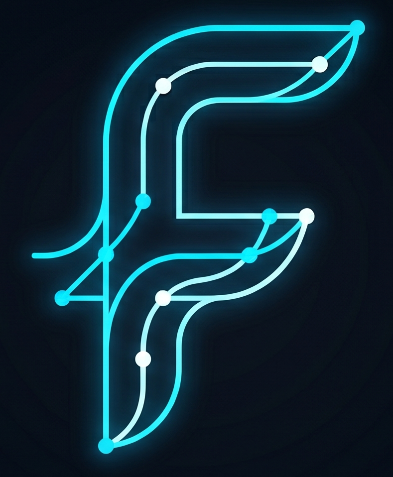
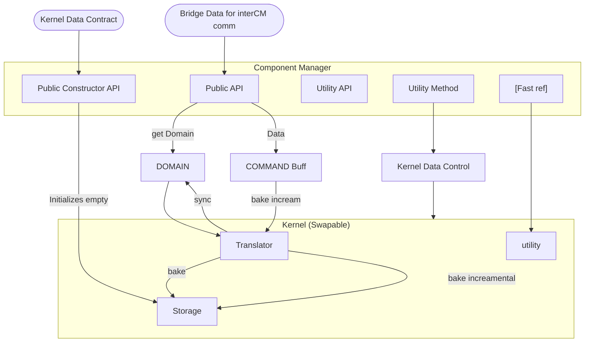

#    FDS: Field Dynamic System


**A hardware-accelerated simulation framework for stochastic dynamic systems.**

## The Engine Framework
FDS models multi-entity environments where discrete state transitions are governed by mathematical vector *fields*. By encoding transition probabilities into these dynamic fields, FDS allows researchers to seamlessly swap fundamental physics and interaction rules with minimal code friction. It provides the expressiveness of pure Python for system design, while compiling directly to LLVM machine code for uncompromised, hardware-level execution speed.

---

## 📖 Table of Contents
1. [Visual Proof : Deterministic vs. Probabilistic Dynamics](#1-visual-proof--deterministic-vs-probabilistic-dynamics)
2. [Interactive Demos: The Colab Environments](#2-interactive-demos-the-colab-environments)
3. [FDS : Theory Overview](#3-field-dynamic-system-theory-overview)
4. [Core Architecture & Philosophy](#4-the-dual-flow-architecture-domain-vs-kernel)
5. [Quick Start / Code Example](#5-quick-start-running-the-engine-v09)
6. [Roadmap: The FDSWrapper API](#6-future-roadmap-the-developer-experience-v10)

## 1. Visual Proof : Deterministic vs. Probabilistic Dynamics

<table align="center">
  <tr>
    <td align="center"><b>Classical Probabilistic (Markov Field)</b></td>
    <td align="center"><b>Classical Deterministic (Bouncing Box)</b></td>
  </tr>
  <tr>
    <td>
      <!-- Path to the overlapping fields GIF -->
      
    </td>
    <td>
      <!-- Path to the bouncing box GIF -->
      
    </td>
  </tr>
  <tr>
    <td valign="top">
      <b>Behavior:</b> Particles perform a biased random walk. While movement is stochastic, the underlying environment actively drives the collective drift of the system.
    </td>
    <td valign="top">
      <b>Behavior:</b> A collection of particles bouncing around in a box. Every particle has momentum, collides with walls, and moves deterministically.
    </td>
  </tr>
  <tr>
    <td valign="top">
      <b>Engine Mechanics:</b> The Global Field maps non-uniform environmental weights (e.g., 2.0 on the left, 1.0 on the right). The Generator multiplies local Markov transitions by these global weights to create an asymmetric probability distribution. The Operator then stochastically samples this field, causing a calculated drift toward higher-weight regions.
    </td>
    <td valign="top">
      <b>Engine Mechanics:</b> The field maps strict kinematic states (velocity/momentum vectors). The Generator calculates exact future trajectories based on momentum. The Operator handles all boundary logic (wall checks) and executes the positional updates deterministically. The discrete Topology component is bypassed entirely.
    </td>
  </tr>
</table>

## 2. Interactive Demos: The Colab Environments

Don't take our word for it. The core backend of the **Field Dynamic System (FDS)** is available to test, fork, and verify directly in your browser. 

[](https://colab.research.google.com/drive/1ilXh1Z-xg83XilleJGA4lG8OXFCWFaR8?usp=sharing)

<p align="center">

</p>

### FDS Engine: Relativistic Quantum Walk Colab Notebook Demo
This live environment models complex multi-entity systems with flexible physics, executing at hardware speeds. It exposes the raw internal Component Managers (v0.9) to prove backend speed before the `FDSWrapper` API (v1.0) fully abstracts the memory mapping layers.

**Engine Highlights Demonstrated:**
* **Dual-Flow Design:** Physics are defined in readable Python, but dynamically translated into contiguous memory blocks.
* **C-Level Speed:** The core math is compiled Just-In-Time (JIT) via `Numba` (LLVM).
* **$\mathcal{O}(1)$ Spatial Hashing:** Eliminates standard graph-search bottlenecks, enabling 40,000+ states to process in sub-250ms.

<details>
<summary><b style="font-size: 1.2em; cursor: pointer;">⚛️ Click to expand: The Theoretical Framework & Physics Model</b></summary>
<br>

This simulation does not use classical Newtonian mechanics. Instead, it models a **Relativistic Quantum Walk** where particles exist as probability waves expanding across a discrete spatial tensor, governed by complex-valued interference and quantum measurement.

#### 1. The Discrete Spatial Tensor (Topology)
Space is quantized into a discrete, bounded graph structure $G = (V, E)$. The position of a particle is a discrete coordinate state $|q, r\rangle$. The engine dynamically builds a non-Euclidean connectivity web (e.g., 6-fold hexagonal symmetry). The bounded radius $R$ acts as an infinite potential well, forcing wave functions to reflect and interfere with themselves at the boundaries.

#### 2. Quantum Superposition & Momentum Currents
Unlike classical random walks, a particle here is defined by a state vector containing both its position and its momentum trajectory (analogous to a relativistic Dirac spinor). The state of the system at time $t$ is:

$$|\psi(t)\rangle = \sum_{x, d} \alpha_{x,d}(t) |x, d\rangle$$

*(where $x$ is the spatial coordinate, $d$ is the discrete momentum direction, and $\alpha \in \mathbb{C}$ is the complex probability amplitude).* Overlapping wavefronts exhibit true quantum mechanical **constructive and destructive interference**.

#### 3. The Observer Effect (Wave Function Collapse)
After the wave expands for $\Delta t$ steps, the engine simulates a measurement. The superimposed wave must collapse into a single, observable classical state. Probability is dictated by the **Born Rule**:

$$P(x) = |\psi(x)|^2 = \text{Re}(\alpha)^2 + \text{Im}(\alpha)^2$$

#### 4. Multi-Particle Exclusion (Fermionic Behavior)
Because this is a multi-entity simulation, collapse happens sequentially. The engine enforces an exclusion principle, ensuring that subsequent probability waves cannot collapse multiple particles into the same discrete node, mapping the vector field into distinct, non-overlapping classical trajectories.

</details>

## 3. Field Dynamic System: Theory Overview

The **Field Dynamic System (FDS)** is a mathematical framework for modeling discrete, multi-entity stochastic systems. Rather than calculating step-by-step trajectories, FDS orchestrates a continuous cycle of **path exploration** (wave expansion) and **state transition** (particle collapse).

> 📖 **Deep Dive:** For the exact mathematical formulation of the inner product spaces and Markov generators, read the [FDS Theoretical Formulation](docs/theory.md).

### The Five Pillars of FDS

1.  **State Space (The Configuration)**
    The fundamental set of all possible discrete states the system can occupy—ranging from a simple 2D coordinate grid to high-dimensional ensemble configurations.
    *🔗 [Defining State Spaces & Configurations](docs/state_space.md)*

2.  **Topology (The Connectivity)**
    The "road network" of the system. It defines the connectivity rules and determines exactly which state transitions are possible. It is responsible for searching the valid frontier of paths reachable over $N$ iterations.
    *🔗 [Topology & Boundary Mathematics](docs/topology.md)*

3.  **Fields (The Algebraic Weights)**
    Fields encode the rules governing transition probabilities. Formally defined as an inner product vector space, the **Field Algebra** dictates physical reality—whether using standard floats for classical diffusion or `complex128` for quantum interference.
    *🔗 [Implementing Custom Field Algebras](docs/algebras.md)*

4.  **The Generator (The Path Integral Explorer)**
    A generalized Markov chain that searches all possible paths to a frontier state, accumulating field weights along the way. This effectively performs a **discrete path integral**, calculating the superimposed probability field before any entity moves.
    *🔗 [Generator Wave Expansion Mechanics](docs/generator.md)*

5.  **The Operator (The Observer & Collapser)**
    The component that collapses the "wave of possibility" into reality. It evaluates the superimposed fields, applies domain-specific rules (e.g., the Born Rule or collision avoidance), and forces the system into a single new state.
    *🔗 [Operator Contracts & Wave Collapse](docs/operator.md)*

---

### 🔄 The FDS Execution Flow

FDS binds these components into a strict, memory-safe execution loop optimized for hardware-level performance:

1.  **Initialize:** The system stores the initial state and starting field values.
2.  **Propagate (Generator):** The engine expands the possibility frontier over $N$ steps, accumulating field weights via LLVM-accelerated kernels.
3.  **Observe (Operator):** The Operator evaluates the generated fields to determine the most probable (or deterministic) outcome.
4.  **Collapse:** The entity adopts the new state, the field collapses to unity at that specific coordinate, and the cycle repeats.


## 4. The Dual-Flow Architecture: Domain vs. Kernel

The FDS engine achieves its speed through a strict **Dual-Flow Architecture**. It completely decouples user-friendly, high-level object manipulation from hardware-friendly, contiguous memory operations.



### The Problem: Why Decouple?
Passing high-level Python objects (like dictionaries or node instances) into a fast computational loop destroys cache locality and prevents LLVM/C++ compilation. 

### The Solution: The Three Layers

**1. The Component Manager (CM) & State Enums**
The orchestrator of the engine. It manages the lifecycle of the data and acts as the strict boundary between the Python API and the compute hardware. 
*   **State Enums:** It uses strict states (`UNBAKED`, `READY`, `DIRTY`) to ensure no high-level data is processed until it is safely translated for hardware.

**2. The Middle Layer: Domain vs. CS (Component Storage)**
*   **The Domain:** The human-readable Python objects (e.g., node graphs, spatial boundaries). Easy to write, terrible for performance.
*   **The Kernel Data Contract:** Defines absolute maximum memory limits *before* operation.
*   **The CS (Component Storage):** The CM uses the Contract to pre-allocate massive, flat C-contiguous arrays. Once the simulation starts, *no new memory is dynamically allocated*.

**3. The Kernel (Swappable)**
The Kernel is the raw compute engine. It is swappable (Python, Numba, C++) as long as it respects the Data Contract. It contains three pillars:
*   **Translator:** The bridge. It parses the unoptimized `Domain` objects and "bakes" them down into the strict, contiguous arrays of the `CS`.
*   **Utility:** The hardware-friendly operations (e.g., the JIT-compiled Ping-Pong loops). It executes using only the flat arrays.
*   **FastRef:** To prevent scope pollution, the CM generates a lightweight `FastRef`. It passes *only* the specific memory pointers the Utility needs, enforcing strict data encapsulation.

---

### 🔄 The Execution Lifecycle

1.  **Contract & Allocation:** The user passes a `Domain` and a `Data Contract` to the CM. The CM pre-allocates an empty, contiguous `CS`.
2.  **The Initial Bake:** The `Translator` packs the Python `Domain` objects tightly into the `CS`. The CM switches to `READY`.
3.  **The Hot Loop:** During simulation, the CM routes a `FastRef` to the `Utility` methods. Execution happens at native C-speeds.
4.  **Runtime Mutation (Command Buffer):** If data needs to change during the run (e.g., deleting a node), the CM uses a **Command Buffer** to queue the change and triggers an "incremental bake," preventing memory fragmentation.
5.  **Synchronization:** To read the output, the CM triggers a `sync`. The Translator reconstructs human-readable `Domain` objects from the raw `CS` arrays.

## 5. Quick Start: Running the Engine (v0.9)

Currently, the engine exposes the raw Component Managers. This requires you to manually define the `Data Contract` and trigger the `baking` process before the Hot Loop begins.

Here is a conceptual example of initializing the engine for a basic field expansion:
```python
from fds.core import DataContract
from fds.managers import TopologyCM, FieldCM, GeneratorCM, OperatorCM

# 1. Define the Data Contract (Strict Memory Caps)
contract = DataContract(max_particles=100, max_states=10000)

# 2. Initialize the Component Managers (Pre-allocates the flat CS arrays)
topology = TopologyCM(contract)
global_field = FieldCM(contract)
generator = GeneratorCM(contract)
operator = OperatorCM(contract)

# 3. The Initial Bake (Domain -> Kernel Storage)
# We map a basic 2D Euclidean grid basin
basin_nodes = topology.generate_basin(origin=(0,0), radius=50)
topology.bake(basin_nodes) 

# Assign environmental weights (e.g., the 2.0 / 1.0 bias)
global_field.bake_weights(topology.get_fast_ref()) 

# 4. The Hot Loop (Native Hardware Execution)
for step in range(SIMULATION_STEPS):
    # Generator expands the wave (Ping-Pong Buffer propagation)
    generator.expand_field(steps=4, topology_ref=topology.get_fast_ref())
    
    # Operator collapses the wave to determine the next discrete state
    operator.evolve(generator_ref=generator.get_fast_ref())
```
## 6. Future Roadmap: The Developer Experience (v1.0+)

Version 0.9 proves the hardware-level speed and mathematical flexibility of the FDS architecture. The focus for v1.0 and beyond is Developer Experience (DX)—abstracting the low-level memory management and expanding the engine's physical capabilities.

*   **The FDSWrapper API:** A unified, top-level abstraction module that wraps both Classical and Field Dynamic Systems. Users will be able to define physics entirely in Python without manually managing `Data Contracts` or `Component Managers`.
*   **The Ensemble Module (Multi-Entity Systems):** A specialized execution manager for simulating multiple entities with interacting or entirely different physics. The Ensemble will intelligently sort, group, and batch these distinct systems, translating them into unified hardware operations for massive parallel performance.
*   **Next-Gen Kernels & JAX Integration:** Currently, users must write their own Numba JIT-decorated methods for custom utilities. Future versions will handle compilation internally and introduce support for **JAX**, unlocking native GPU tensor operations and auto-differentiation.
*   **Dynamic Topology Auto-Scaling:** Eliminating the need to manually guess or hardcode memory caps. The engine will dynamically estimate max array sizes based on initial spatial boundaries and auto-configure the C-arrays.
*   **Generic Field Algebras:** Upgrading the Field and Generator components to support swappable compositions and transformations. Users will be able to inject custom mathematical transformations into a single algebra dynamically, without rewriting the core propagation loops.
*   **Optimized Topology Lookups:** Further refinement of the $O(1)$ spatial hashing and coordinate resolution to push bounding-box processing speeds even higher.
*   *...and more performance enhancements as the core API solidifies.*
