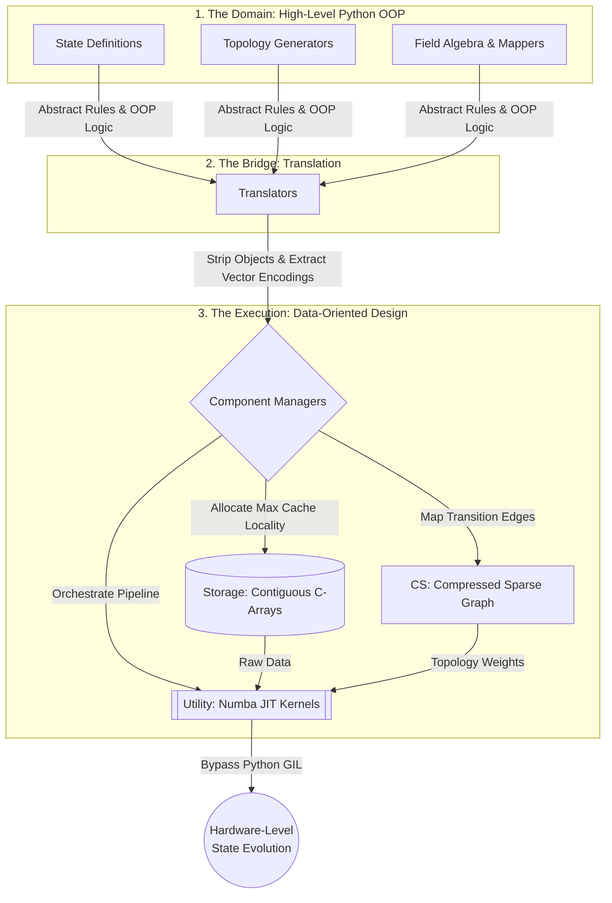

# Discrete State Engine (DSE)

A high-performance, Data-Oriented Design (DOD) framework for solving massive Markovian state-spaces, discrete-time quantum walks, and lattice field dynamics.

## 1. The Origin: Generic Flexibility vs. Bare-Metal Efficiency
Building a highly specialized, hardcoded simulator is easy. Building a generic, abstract framework is also relatively easy. Building a generic framework that actually executes at bare-metal speeds is an immense engineering challenge.

This project was born from that exact hardship. When tracking tens of thousands of unique mathematical states and complex transition rules, standard high-level Object-Oriented (OOP) implementations choke on memory allocation overhead and CPU cache misses. The **Discrete State Engine (DSE)** solves this von Neumann bottleneck by strictly separating the *definition* of the physics from the *execution* of the math. 

## 2. The Dual-Flow Architecture
To achieve generic flexibility alongside high-speed execution, this engine utilizes a Dual-Flow architecture. Users define the rules in high-level Python, and the engine's Bridge translates them into a completely stateless, Data-Oriented Component System for JIT-compiled execution.



### The Component Pipeline:
* **The Domain:** Pure Python API for defining the physical algebra and Markovian rules.
* **The Translators:** Intercepts the domain rules, stripping away all high-level objects to map them into pure vector encodings.
* **Storage:** Manages the contiguous 1D/2D memory buffers to maximize L1/L2 cache locality.
* **CS (Compressed Sparse):** Structures the transition probabilities into sparse row matrices to prevent memory bloat in highly interconnected topologies.
* **Component Managers (CM):** The orchestrators that route data between Storage, CS, and Utility.
* **Utility:** The pure, pre-compiled Numba C-kernels that execute the matrix operations.

## 3. The Proof: Scaling Benchmark
By bypassing Python's Global Interpreter Lock (GIL) and maximizing CPU cache locality, the DOD architecture scales linearly against exponential state growth.

When benchmarked on a 3-fold recurrent topology processing >10,000 unique states and 31,000 transition edges per step:
* **Standard Domain Implementation:** 1.097 seconds
* **DOD Engine Execution:** 0.010 seconds
* **Result:** **>105x Performance Speedup.**


## 4. Applications: Vector Encoding & Markovian Rules
Because the engine abstracts "States" into pure mathematical indices and links them via generic Markovian chain rules, it acts as a generalized solver for highly complex systems:

* **Quantum Mechanics:** Simulates discrete path integrals, 4D Grover coins, and Laplacian wave interference acting as open thermodynamic systems.
* **Quantitative Finance:** High-speed stochastic modeling for exotic option pricing grids.
* **Artificial Intelligence:** Blazing-fast Markov Decision Process (MDP) solver for reinforcement learning state-spaces.


## 5. API Design: The Developer Experience
Despite the C-level performance under the hood, initializing complex topologies and rule sets takes only a few lines of clean Python.

```python
# 1. Define the Generic Algebra and Field Mapper
algebra = FieldAlgebra(dimensions=2, dtype=np.complex128)
mapper = FieldMapper(algebra=algebra, state_class_ref=State)

# 2. Configure the Generic Markovian Rules
gen_data = GenericMarkovianFieldGeneratorData(
    mapper=mapper, 
    topology=topology_domain, 
    transition_function=natural_path_integral_transition,
    maximum_step_baking=100
)

# 3. Execute the Numba DOD Pipeline
generator_cm.generate_steps(steps=100)
```
