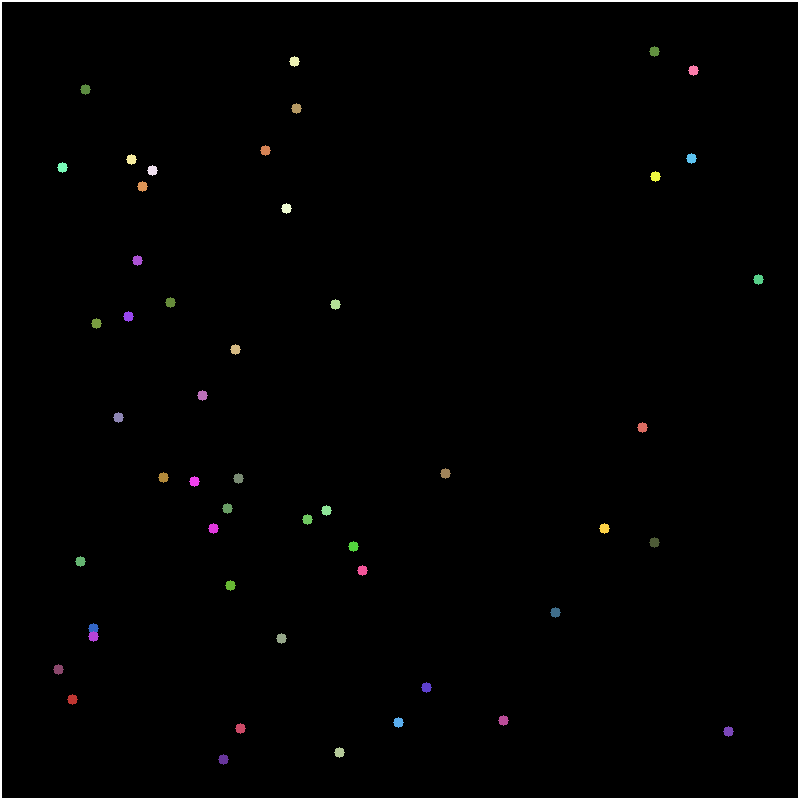

# FDS: Field Dynamic System Engine

**Classical and Quantum stochastic modeling through a unified, hardware-accelerated pipeline.**

FDS is a modular engine designed to simulate multi-entity dynamic systems where state transitions are governed by propagating fields. To overcome the computational limits of standard object-oriented modeling, FDS implements a strict **Dual-Flow Architecture**. 

Systems are designed in a rich, human-friendly **Domain layer**, then translated via strict contracts into **Data-Oriented Kernels** for blistering, hardware-friendly execution. By bypassing the Python GIL and structuring memory into contiguous C-arrays, FDS achieves sub-second batch processing for complex path integrals and dense branching.

---

## Visual Proof: One Pipeline, Infinite Domains

Because FDS separates the physics (Domain) from the execution (Kernel), you can simulate fundamentally different mathematical realities simply by swapping the Field Algebra and Operator contracts.

**Classical Deterministic System** | **Quantum Probabilistic System**
--- | ---
 | 
*Entities reacting to hard topological boundaries and classical gradients.* | *Entities experiencing phase-shift interference and Born Rule wave collapse.*

> **Note:** Both simulations above are executed through the exact same FDS pipeline at C-level speeds.

## The Field Dynamic System (FDS)

At its core, FDS is a mathematical framework for modeling discrete, multi-entity stochastic systems. FDS stores the initial state of the system and orchestrates a continuous cycle of **path exploration** (wave expansion) and **state transition** (particle collapse).

> 📖 **Deep Dive:** For the exact mathematical formulation of the inner product spaces and Markov generators, read the [FDS Theoretical Formulation](docs/theory.md).

The engine operates on five theoretical pillars:

### 1. State Space (The Configuration)
The fundamental set of all possible discrete states the system can occupy. Depending on the simulation, this can be a simple 2D coordinate grid or a high-dimensional ensemble configuration space.
*🔗 See: [Defining State Spaces & Configurations](docs/state_space.md)*

### 2. Topology (The Connectivity)
If the State Space is the map, Topology is the road network. It defines the connectivity rules, determining exactly which state transitions are possible from any initial state. It is responsible for searching the valid frontier of paths the system can reach over a given number of iterations.
*🔗 See: [Topology & Boundary Mathematics](docs/topology.md)*

### 3. Fields (The Algebraic Weights)
Fields encode the mathematical rules governing transition probabilities. Formally defined as an inner product vector space (with defined addition, multiplication, unity, and null values), the Field maps a specific mathematical weight to every state. This **Field Algebra** dictates the physical reality of the simulation, whether using standard floats for classical diffusion or `complex128` arrays for quantum interference.
*🔗 See: [Implementing Custom Field Algebras](docs/algebras.md)*

### 4. The Generator (The Path Integral Explorer)
Given the Topology and Field Algebra, the Generator acts as a highly advanced, generalized Markov chain. It searches through all possible paths the system could take to reach a frontier state, accumulating the field weights for every transition along the way. This effectively performs a discrete path integral, calculating the superimposed probability field without actually moving the entities.
*🔗 See: [Generator Wave Expansion Mechanics](docs/generator.md)*

### 5. The Operator (The Observer & Collapser)
While the Generator expands the wave of possibility, the Operator collapses it into reality. It evaluates the superimposed fields, applies domain-specific rules (e.g., the Born Rule or collision avoidance), and forces the system into a single, definitive new state. 
*🔗 See: [Operator Contracts & Wave Collapse](docs/operator.md)*

---

### 🔄 The FDS Execution Flow
FDS is the culmination of these components, binding them into a strict, memory-safe execution loop:

1. **Initialize:** FDS stores the initial state and starting field.
2. **Propagate (Generator):** Expands the possibility frontier over $N$ steps, accumulating field weights.
3. **Observe (Operator):** Evaluates the generated fields and picks the final state.
4. **Collapse:** The entity adopts the new state, the field collapses to unity at that coordinate, and the cycle repeats.