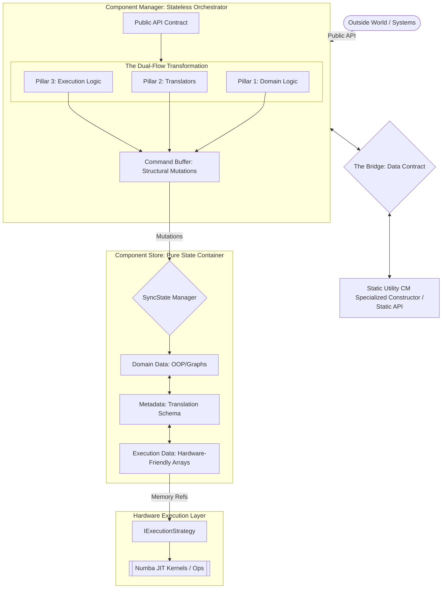
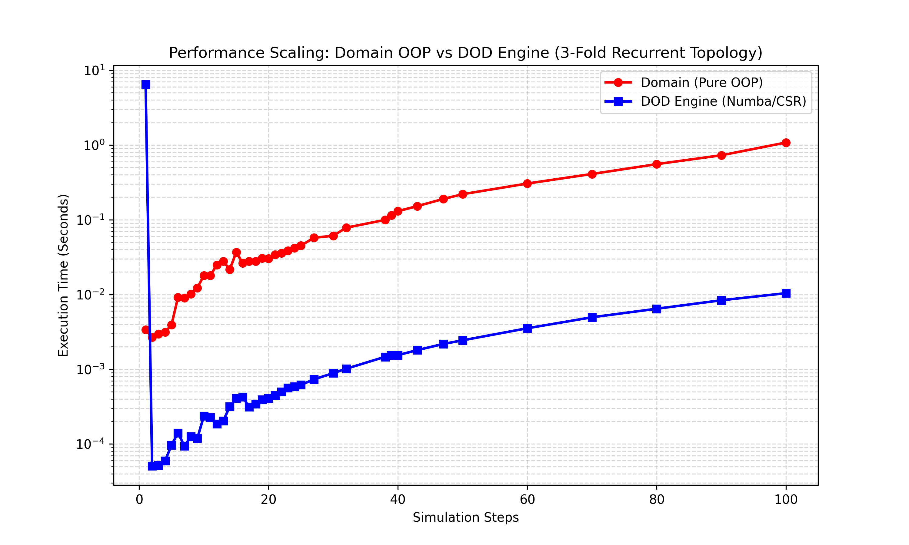
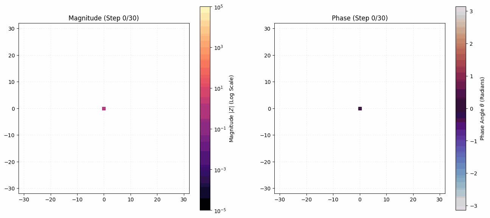

# Discrete State Engine (DSE)

A high-performance framework for solving massive Markovian state-spaces, discrete-time quantum walks, and lattice field dynamics.

## 1. The Philosophy: Generic Structure vs. Hardware Efficiency
Building a highly specialized, hardcoded simulator is easy. Building a generic, abstract framework is also relatively easy. Building a generic framework that actually executes at bare-metal speeds is an immense engineering challenge.

This project was born from the hardship of maintaining a completely generalized structure without sacrificing runtime efficiency. Standard high-level Object-Oriented (OOP) implementations allow for beautiful abstractions but execute poorly on hardware due to memory fragmentation and cache misses. The **Discrete State Engine (DSE)** solves this by utilizing an architecture that transforms generic domain concepts into hardware-friendly, memory-localized data structures before execution.

## 2. The Architecture: The Dual-Flow Pattern
Architecture is not defined by the project's folders, but by the flow of data. Every system within this engine adheres to a strict "Dual-Flow" architectural pattern, bridged by a Transformation Layer and orchestrated via shared inter-module communication.

1. **The Domain Layer (Generic Structure):** High-level, flexible Python OOP. This layer focuses entirely on abstract definitions—what a state is, how a topology is linked, or what the mathematical algebra dictates.
2. **The Transformation Layer:** The bridging mechanism. Translators intercept the generic domain data, strip away all OOP overhead, and map the abstractions into numerical indices and vector encodings.
3. **The Hardware-Friendly Layer:** Pure, contiguous arrays prioritizing memory locality. This layer is completely agnostic to the domain abstractions; it only understands matrix math and vector operations, making it highly optimized for hardware execution (bypassing the GIL).



## 3. The Project Structure: Implementation of the Architecture
The physical structure of the repository is divided into discrete modules. Each module independently implements the Dual-Flow architecture to handle its specific domain responsibility before communicating with the master orchestrator.

* **`/src/state`:** Defines the mathematical entities. Translates generic state abstractions into contiguous state-value arrays.
* **`/src/topology`:** Defines the spatial grid. Translates generic node-edge connections into hardware-friendly Compressed Sparse Row (CSR) matrices.
* **`/src/field`:** Defines the complex algebra. Translates mapping rules into pre-allocated memory buffers.
* **`/src/generator`:** Uses the generic chain rule to build the fields over multiple possible paths. It used the field algebra and its operation to build the field over multiple steps and get the probability

### Inter-Module Communication
To prevent isolated silos, the architecture relies on a strict communication protocol:
* **Data Bridges:** Modules do not pass OOP objects to one another. They communicate strictly through Data Bridges that pass the transformed, hardware-friendly arrays.
* **Static Utility Component Manager:** Instead of duplicating execution logic, modules route their localized data arrays to a shared Static Utility Component Manager, which handles the overarching orchestration and hardware execution of the kernels for the Generator.

## 4. The Proof: Execution Benchmark
By isolating the OOP abstractions and executing solely on the hardware-friendly array layer, the architecture achieves massive scalability.

When benchmarked on a 3-fold recurrent topology processing >10,000 unique states and 31,000 transition edges per step:
* **Standard Generic OOP Implementation:** 1.097 seconds
* **Dual-Flow Engine Execution:** 0.010 seconds
* **Result:** **>105x Performance Speedup.**



## 5. Applications
Because the engine abstracts states into pure vector encodings and links them via Markovian rules, it acts as a generalized solver for highly complex systems:
* **Quantum Mechanics:** Simulates discrete path integrals, 4D Grover coins, and Laplacian wave interference.
* **Quantitative Finance:** Stochastic modeling for exotic option pricing grids.
* **Artificial Intelligence:** Markov Decision Process (MDP) solver for reinforcement learning state-spaces.



## 6. Quick Start API
Despite the rigid architectural transformations under the hood, initializing the pipeline remains highly declarative at the top level.

```python
# 1. Define the Generic Domain Structure
algebra = FieldAlgebra(dimensions=2, dtype=np.complex128)
mapper = FieldMapper(algebra=algebra, state_class_ref=State)

# 2. Configure the Generator Rules
gen_data = GenericMarkovianFieldGeneratorData(
    mapper=mapper, 
    topology=topology_domain, 
    transition_function=natural_path_integral_transition,
    maximum_step_baking=100
)

# 3. Execute the Transformation & Hardware-Friendly Pipeline
generator_cm.generate_steps(steps=100)
```
