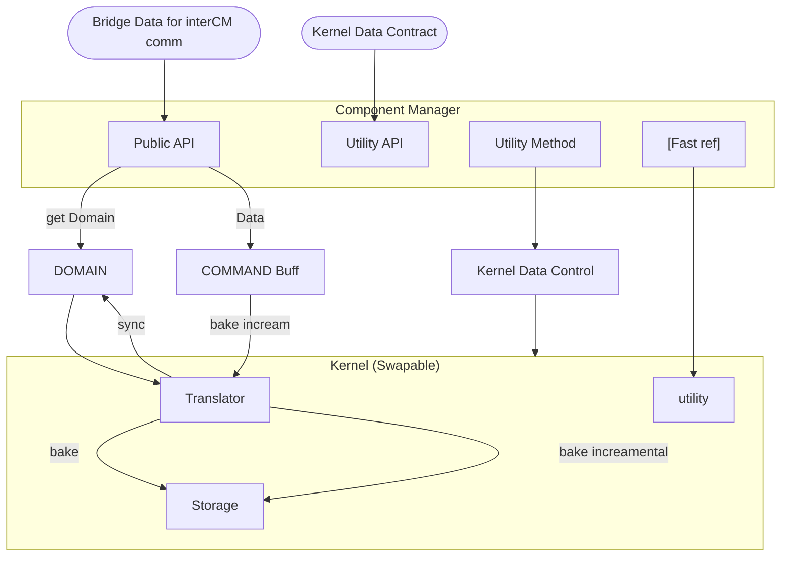

# FDS: Field Dynamic System Engine


**Classical and Quantum stochastic modeling through a unified, hardware-accelerated pipeline.**

FDS is a modular engine designed to simulate multi-entity dynamic systems where state transitions are governed by propagating fields. To overcome the computational limits of standard object-oriented modeling, FDS implements a strict **Dual-Flow Architecture**. 

Systems are designed in a rich, human-friendly **Domain layer**, then translated via strict contracts into **Data-Oriented Kernels** for blistering, hardware-friendly execution. By bypassing the Python GIL and structuring memory into contiguous C-arrays, FDS achieves sub-second batch processing for complex path integrals and dense branching.

---

## Visual Proof: One Pipeline, Infinite Domains

Because FDS separates the physics (Domain) from the execution (Kernel), you can simulate fundamentally different mathematical realities simply by swapping the Field Algebra and Operator contracts.


**Classical Deterministic System** | **Quantum Probabilistic System**
--- | ---
 | 
*Entities reacting to hard topological boundaries and classical gradients.* | *Entities experiencing phase-shift interference and Born Rule wave collapse.*

> **Note:** Both simulations above are executed through the exact same FDS pipeline at C-level speeds.

## The Field Dynamic System (FDS)

At its core, FDS is a mathematical framework for modeling discrete, multi-entity stochastic systems. FDS stores the initial state of the system and orchestrates a continuous cycle of **path exploration** (wave expansion) and **state transition** (particle collapse).

> 📖 **Deep Dive:** For the exact mathematical formulation of the inner product spaces and Markov generators, read the [FDS Theoretical Formulation](docs/theory.md).

The engine operates on five theoretical pillars:

### 1. State Space (The Configuration)
The fundamental set of all possible discrete states the system can occupy. Depending on the simulation, this can be a simple 2D coordinate grid or a high-dimensional ensemble configuration space.
*🔗 See: [Defining State Spaces & Configurations](docs/state_space.md)*

### 2. Topology (The Connectivity)
If the State Space is the map, Topology is the road network. It defines the connectivity rules, determining exactly which state transitions are possible from any initial state. It is responsible for searching the valid frontier of paths the system can reach over a given number of iterations.
*🔗 See: [Topology & Boundary Mathematics](docs/topology.md)*

### 3. Fields (The Algebraic Weights)
Fields encode the mathematical rules governing transition probabilities. Formally defined as an inner product vector space (with defined addition, multiplication, unity, and null values), the Field maps a specific mathematical weight to every state. This **Field Algebra** dictates the physical reality of the simulation, whether using standard floats for classical diffusion or `complex128` arrays for quantum interference.
*🔗 See: [Implementing Custom Field Algebras](docs/algebras.md)*

### 4. The Generator (The Path Integral Explorer)
Given the Topology and Field Algebra, the Generator acts as a highly advanced, generalized Markov chain. It searches through all possible paths the system could take to reach a frontier state, accumulating the field weights for every transition along the way. This effectively performs a discrete path integral, calculating the superimposed probability field without actually moving the entities.
*🔗 See: [Generator Wave Expansion Mechanics](docs/generator.md)*

### 5. The Operator (The Observer & Collapser)
While the Generator expands the wave of possibility, the Operator collapses it into reality. It evaluates the superimposed fields, applies domain-specific rules (e.g., the Born Rule or collision avoidance), and forces the system into a single, definitive new state. 
*🔗 See: [Operator Contracts & Wave Collapse](docs/operator.md)*

---

### 🔄 The FDS Execution Flow
FDS is the culmination of these components, binding them into a strict, memory-safe execution loop:

1. **Initialize:** FDS stores the initial state and starting field.
2. **Propagate (Generator):** Expands the possibility frontier over $N$ steps, accumulating field weights.
3. **Observe (Operator):** Evaluates the generated fields and picks the final state.
4. **Collapse:** The entity adopts the new state, the field collapses to unity at that coordinate, and the cycle repeats.

## The Dual-Flow Architecture (Data-Oriented Design)

Most Python physics engines force a compromise: they are either easy to write but slow to execute, or fast to execute but a nightmare to maintain. FDS solves this by abandoning object-oriented processing in the simulation hot-loop, utilizing a strict **Dual-Flow Architecture** built on Data-Oriented Design (DOD) principles.

The engine separates the conceptual rules of the simulation from the hardware execution.

### The Data Flow & Dependency Injection


Details: For the exact memory layout of the component storage and the incremental baking queues, read the CM Architectural Specification.

### **The Core Components**

1. The Domain Layer: Where users define Topologies, Field Algebras, and Entities using rich, readable Python objects.

2. The Component Manager (CM): The translation bridge.

Initialization: The KernelDataContract is injected into the CM's constructor. The CM then uses this contract to initialize the empty Component Storage layout before any domain data is baked.

Public API: Safely accepts Bridge Objects for inter-CM communication.

Utility Layer: The Utility API and internal Fast References allow Utility Methods to execute fast internal calculations by directly accessing Kernel Data.

The Translator: It takes queued commands (bake_incremental) or direct Domain inputs (bake) and flattens them into the pre-allocated memory blocks.

Component Storage (CS): Maintains a synchronized dual-state: the mapped Domain Data for user readouts, and the Kernel Data optimized for the execution engine.

3. The Kernel Contract (Dependency Injection): The rigid blueprint that ensures the Component Storage perfectly matches what the hardware expects.

4. The Kernel Layer: The execution engine grabs the optimized data via an external Fast Reference pointer and computes wave expansions and collapses at hardware speeds.

Zero-Friction Hot Swapping
Because the execution engine only interacts with the Component Storage via injected Fast References defined by the Contract, kernels are perfectly hot-swappable. A user can swap the default kernel for a custom backend without rewriting a single line of Domain logic.

## 🚀 Quick Start (The Hello World of FDS)

Despite the heavy data-oriented architecture under the hood, writing an FDS simulation in the Domain layer is completely object-oriented and user-friendly. 

Here is how you initialize the engine, define a space, and run a simulation tick:

```python
import numpy as np
from particle_grid_simulator.src.dynamic_system.domain.data.single_channel_fds import SingleChannelFDSData, SingleChannelFDSRunner
# ... (imports for Component Managers, Numba Storage, and Translators)

# ==========================================
# 1. Dependency Injection: Initialize Component Managers
# ==========================================
# Each manager is explicitly injected with its specific Kernel Contract, Storage, Translator, and Utility.
topology_cm = TopologyComponentManager.create_from_raw_data(
    t_contract, NumbaTopologyStorage(t_contract), NumbaTopologyTranslator(), NumbaTopologyUtility
)

generator_cm = GeneratorComponentManager(
    gen_contract, NumbaComplexCSRGeneratorStorage(gen_contract), 
    GenericGeneratorTranslator(), GenericGeneratorKernelUtility, uniform_complex_transition
)

field_cm = FieldComponentManager.create_from_raw(
    NumbaComplexUtility, f_contract, NumbaComplexFieldKernelStorage(f_contract), ...
)

operator_cm = OperatorComponentManager.create_raw(
    smart_exclusive_born_kernel, NumbaOperatorUtility(), State
)

# ==========================================
# 2. System Binding
# ==========================================
# Define initial states (e.g., 10 particles) and complex wave amplitudes
s0 = np.zeros((10, 2), dtype=np.float64) 
f0 = np.ones((10, 1), dtype=np.complex128)

# Bind the component managers into a single synchronized data structure
system_data = SingleChannelFDSData(
    _initial_states=s0, _initial_fields=f0,
    _topology_cm=topology_cm, _field_cm=field_cm, 
    _generator_cm=generator_cm, _operator_cm=operator_cm,
    _save_directory="./plots"
)

runner = SingleChannelFDSRunner(system_data, SingleChannelFDSUtility)

# ==========================================
# 3. The Hot-Loop (Hardware-Friendly Execution)
# ==========================================
print("Running Quantum Loop...")
for tick in range(60):
    # Phase 1: Wave Expansion (Generator searches paths and accumulates complex weights)
    runner.next(apply_generator=True, steps=5)

    # Phase 2: Observation & Collapse (Operator evaluates probability and forces a discrete state)
    runner.next(apply_generator=False)

runner.end(compile_csv=True)
```
