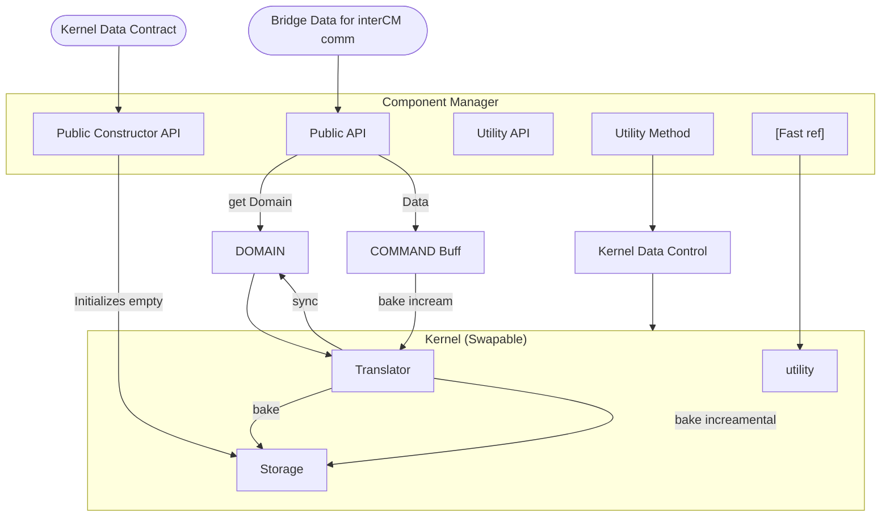

# Field Dynamic System (FDS): Core Theory & Architecture

## 1. The Core Components
FDS is a high-performance, Data-Oriented simulation engine built on a **Dual-Flow Architecture**. It rigorously separates human-readable physics definitions (The Domain) from hardware-optimized execution arrays (The Kernel). The system is driven by six core theoretical components:

### State Space & Configuration
At the fundamental level, a system within FDS has a **State** that defines its exact current configuration. The **State Space** is the mathematical set of all possible states the system could theoretically occupy (e.g., a 1D line, a 2D grid, or a 4D phase space). The engine is strictly coordinate-agnostic.

### Topology (The Map)
If the State Space defines *where* a system can exist, the **Topology** defines *how* it moves. It dictates the valid transitions a system can make in a single tick, from which global boundaries organically emerge.
* **Neighbors ($V[s]$):** The states reachable in exactly one step.
* **Frontiers ($F^l[s]$):** The expanding leading edge of states the system could occupy in exactly $l$ steps.

### Field Algebra (The Math)
A Field Algebra is an **Inner Product Vector Space** that defines the dynamic quantities (weights, probabilities, amplitudes) traveling along the topological pathways. It dictates how waves combine (Addition $\oplus$) and how they scale during transition (Multiplication $\otimes$).
* **Classical Diffusion ($\mathbb{R}$):** Real-number probabilities and standard addition.
* **Quantum Mechanics ($\mathbb{C}$):** Complex amplitudes, phase shifts, and interference. The observable weight is defined by the squared norm: $||\psi||^2$.

### The Generator (Wave Expansion)
The **Generator** executes Phase 1 of the hot-loop. It physically bridges the Topology and the Field Algebra. Using Compressed Sparse Row (CSR) arrays, it maps the topological neighbors and recursively smears the field amplitude outward across the multi-step frontier, evaluating complex superpositions at hardware speeds.

### The Operator (Wave Collapse)
The **Operator** executes Phase 2 of the hot-loop. After the Generator expands the wave into a state of superposition, the Operator acts as the "Observer." It evaluates the expanded probability wave, enforces systemic constraints (like Pauli exclusion), normalizes the probabilities, and forces the system to probabilistically collapse back into a single discrete classical state.

### The Component Manager (CM)
The **Component Manager** is the architectural orchestrator. It enforces strict Dependency Injection, using a `KernelDataContract` to allocate contiguous memory blocks. Its internal `Translator` flattens rich Python objects into C-arrays, and it passes a `[Fast ref]` (raw memory pointer) to the Execution Kernel, allowing the physics to evaluate millions of states while completely bypassing the Python Global Interpreter Lock (GIL).

---

## 2. The Data Pipeline & Execution Flow
FDS achieves C-level speeds in Python by strictly controlling when and how data moves between the human-readable `DOMAIN` and the hardware-optimized `Storage`. This movement occurs in three distinct chronological phases.

### Phase 1: Initialization (The Cold Boot)
1. **Contract Injection:** The user instantiates a `KernelDataContract` and passes it to the CM's `Public Constructor API`.
2. **Storage Allocation:** The CM uses this contract to initialize empty, flat `Storage` arrays.
3. **Utility Binding:** The `Storage` returns a `[Fast ref]` memory pointer, which the CM binds directly to its internal `Utility API`.

### Phase 2: Staging (The Intermediate Command Buffer)
**The CM never writes Domain updates directly to memory.**
1. **Buffering:** When a mutation request hits the CM's `Public API` (e.g., Bridge Data from another component), the CM queues this operation as a payload into the `COMMAND Buff`.
2. **Race Condition Prevention:** Staging mutations ensures that asynchronous requests can be accumulated safely without corrupting the active memory arrays while a simulation tick is running.

### Phase 3: Execution (The Hot-Loop)
1. **Incremental Bake:** The `Kernel Data Control` triggers the `Translator` to read the `COMMAND Buff`, serialize the queued mutations, and push them into `Storage` (`bake_incremental`).
2. **Hardware Execution:** The `Utility` layer is commanded to run the physics step. Holding the `[Fast ref]`, it reads and writes exclusively to the flat `Storage` arrays at maximum hardware speeds.
3. **Synchronization:** Once the hardware loop finishes, the `Translator` executes a `sync()`, reading the raw numbers from `Storage` and updating the Python objects in the `DOMAIN` so the user can read the results.

```mermaid
sequenceDiagram
    participant Domain as DOMAIN (Python)
    participant CM as Component Manager
    participant Buff as COMMAND Buff
    participant Trans as Translator
    participant Store as Kernel Storage
    participant Util as Kernel Utility

    %% Phase 1
    rect rgb(20, 30, 40)
    Note over Domain, Util: Phase 1: Initialization
    Domain->>CM: Inject KernelDataContract
    CM->>Store: Allocate empty contiguous arrays
    Store-->>CM: Return [Fast ref] memory pointer
    CM->>Util: Bind [Fast ref]
    end

    %% Phase 2
    rect rgb(40, 30, 20)
    Note over Domain, Util: Phase 2: Staging (Command Buffer)
    Domain->>CM: PublicAPI.mutate() / Bridge Data
    CM->>Buff: Queue Mutation Data
    end

    %% Phase 3
    rect rgb(20, 40, 20)
    Note over Domain, Util: Phase 3: Execution (The Hot-Loop)
    CM->>Trans: trigger bake_incremental()
    Trans->>Buff: Read queued mutations
    Trans->>Store: Apply mutations to memory
    CM->>Util: execute step()
    Util->>Store: Read/Write physics via [Fast ref]
    Trans->>Domain: sync() results back to Python objects
    end
```

3. System Architecture
The structural diagram below maps the strict data routing, demonstrating how the Component Manager successfully isolates the Execution Kernel from the Domain layer.
