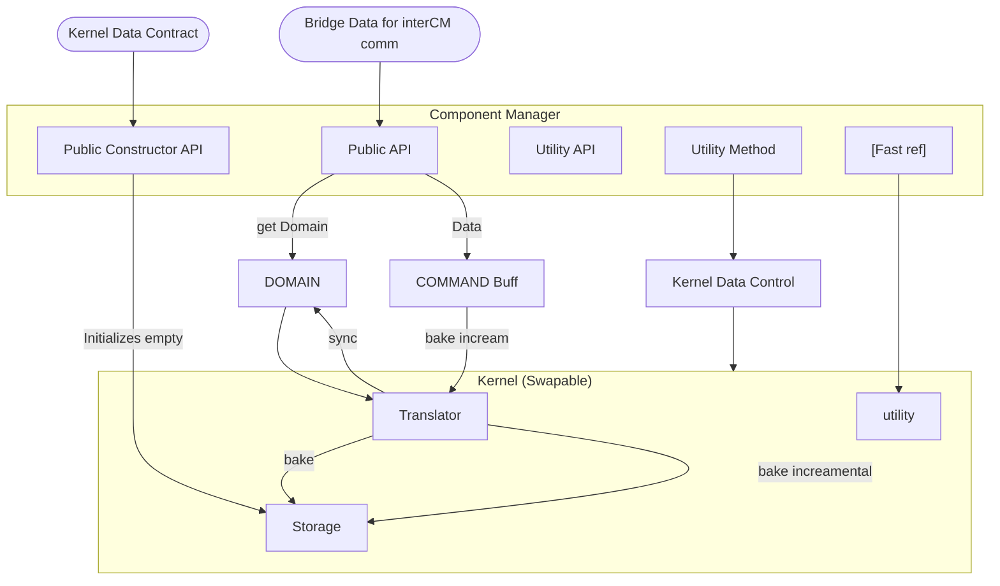

# Field Dynamic System (FDS): Comprehensive Theory & Architecture

## 1. The Vision: The Dual-Flow Architecture
The Field Dynamic System (FDS) is a high-performance, Data-Oriented simulation engine. Its primary objective is to solve the classic bottleneck in scientific computing: the trade-off between human-readable domain logic and hardware-optimized execution. 

To achieve this, FDS utilizes a **Dual-Flow Architecture**. It rigorously separates the rich, object-oriented physics definitions (The Domain) from the flattened, contiguous memory arrays required by the execution backend (The Kernel). By orchestrating how data flows between these two layers, FDS can simulate complex probabilistic systems—from classical diffusion to quantum wave interference—evaluating millions of states without being bottlenecked by the Python Global Interpreter Lock (GIL).

---

## 2. The Theoretical Core (The Physics)

At its heart, FDS simulates systems that transition probabilistically through space and time. This behavior is governed by three mathematical constructs.

### State Space & Configuration
Every system has a **State** that defines its exact current configuration. The **State Space** is the mathematical set of all possible states the system could theoretically occupy. At its theoretical core, FDS is completely abstract—a state can be *any* arbitrary data type. With the help of components like the Topology and Generator, FDS can model any abstract discrete system. While our current implementation showcases coordinate-specific states (e.g., a 1D coordinate, a 2D grid vector, or a 4D position-momentum phase space), the underlying architecture is entirely state-agnostic.

### Topology (The Map)
If the State Space defines *where* a system can exist, the **Topology** defines *how* it moves. It dictates the valid local transitions a system can make in a single tick. From these local rules, global boundaries organically emerge.
* **Neighbors ($V[s]$):** The set of states reachable in exactly one forward step.
* **Frontiers ($F^l[s]$):** The expanding leading edge of states the system could occupy in exactly $l$ steps.

### Field Algebra (The Math)
A Field Algebra is formulated as an **Inner Product Vector Space**. It defines the dynamic quantities (weights, probabilities, or amplitudes) traveling along the topological pathways, dictating how waves combine (Addition $\oplus$) and how they scale across edges (Multiplication $\otimes$).
* **Classical Diffusion ($\mathbb{R}$):** Real-number probabilities utilizing standard addition and scalar multiplication.
* **Quantum Mechanics ($\mathbb{C}$):** Complex amplitudes allowing for phase shifts and true wave interference. The observable weight (probability) is defined by the squared norm of the vector: 
$$||\psi||^2 = \psi_{real}^2+\psi_{imag}^2$$

---

## 3. The Execution Hot-Loop (The Code in Motion)

FDS operates on a two-phase execution cycle. It first expands a probability wave across the mathematical space, and then probabilistically collapses it.

### Phase 1: The Generator (Wave Expansion)
The **Generator** physically bridges the Topology and the Field Algebra. When `runner.next(apply_generator=True)` is called, the Generator searches the state space. 

Utilizing Compressed Sparse Row (CSR) matrices to handle exponential growth, it maps the topological neighbors and recursively smears the field amplitude outward across the multi-step frontier. As multiple paths converge on the same state, the Generator uses the Field Algebra to evaluate complex superpositions (constructive and destructive interference) at hardware speeds.

### Phase 2: The Operator (Wave Collapse)
After the Generator expands the wave into a massive state of superposition, the **Operator** acts as the "Observer" (`runner.next(apply_generator=False)`). 

It evaluates the expanded probability field across the entire multi-step frontier. It enforces global systemic constraints (such as Pauli-like exclusion rules to prevent multi-particle collisions), converts the complex field amplitudes into observable weights via the Born Rule, and normalizes the distribution. Finally, it forces the system to undergo a stochastic collapse, snapping the probability wave back into a single, discrete classical state.

---

## 4. Systems Engineering: The Component Manager

The mathematical engine is driven by the **Component Manager (CM)**, the architectural orchestrator that enforces the strict Dependency Injection boundary between Python and the hardware backend.

### Memory & Fast References
The CM does not inherently know what backend (e.g., Numba, C++, JAX) is executing the math. 
1. The user passes a `KernelDataContract` into the CM's constructor.
2. The CM uses this contract to allocate contiguous memory blocks (`Storage`).
3. The `Storage` returns a `[Fast ref]` (a raw memory pointer).
4. The CM permanently binds this pointer to its internal `Utility API`. 

Because the Execution Kernel only ever interacts with this `[Fast ref]`, it reads and writes to memory instantly, completely isolated from the overhead of the Python Domain.

### The Data Pipeline (Staging and Bakes)
To maintain thread safety and prevent race conditions during the hot-loop, the CM strictly controls data mutations:
* **Staging:** When the user or an external component (via `Bridge Data`) requests a change, the CM queues the mutation into an intermediate `COMMAND Buff`. It never mutates active memory directly.
* **Incremental Bake:** Just before the hot-loop executes, a `Translator` serializes the queued mutations from the buffer directly into the C-arrays.
* **Synchronization:** Once the hardware loop finishes computing the wave expansions and collapses, the `Translator` executes a `sync()`, reading the raw arrays and updating the Python Domain objects so the user can query the results.

---

## 5. Architectural Diagrams

### The Chronological Data Flow
This sequence demonstrates how data moves from initialization, into the staging buffer, and finally through the hardware hot-loop.

```mermaid
sequenceDiagram
    participant Domain as DOMAIN (Python)
    participant CM as Component Manager
    participant Buff as COMMAND Buff
    participant Trans as Translator
    participant Store as Kernel Storage
    participant Util as Kernel Utility

    %% Phase 1
    rect rgb(20, 30, 40)
    Note over Domain, Util: Phase 1: Initialization
    Domain->>CM: Inject KernelDataContract
    CM->>Store: Allocate empty contiguous arrays
    Store-->>CM: Return [Fast ref] memory pointer
    CM->>Util: Bind [Fast ref]
    end

    %% Phase 2
    rect rgb(40, 30, 20)
    Note over Domain, Util: Phase 2: Staging (Command Buffer)
    Domain->>CM: PublicAPI.mutate() / Bridge Data
    CM->>Buff: Queue Mutation Data
    end

    %% Phase 3
    rect rgb(20, 40, 20)
    Note over Domain, Util: Phase 3: Execution (The Hot-Loop)
    CM->>Trans: trigger bake_incremental()
    Trans->>Buff: Read queued mutations
    Trans->>Store: Apply mutations to memory
    CM->>Util: execute step()
    Util->>Store: Read/Write physics via [Fast ref]
    Trans->>Domain: sync() results back to Python objects
    end
```

## 6. The Structural Routing

This flowchart maps the strict boundaries of the architecture, showing how the Component Manager successfully isolates the swappable Execution Kernel from the higher-level Domain logic.

